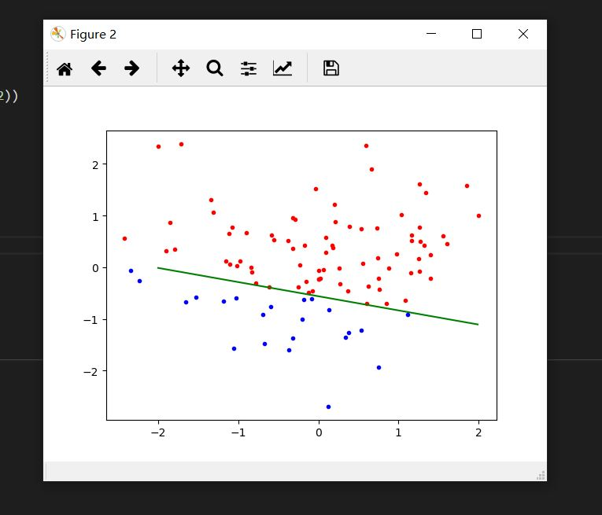
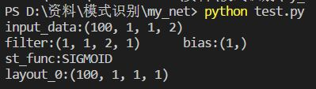

## NeuralNetwork-Numpy
### 模式识别大作业 使用numpy进行深度学习

### 使用方法
```
from net import Net
net = Net()
net.addData(x)
net.addConvLayout([1,1,2,1],bias = True,padding='VAILD',st_func='SIGMOID',init_type='RANDOM',loss_type='MSE')
```
- addData()：添加数据
- addConvLayout()：在当前网络最后面添加一层网络
  
支持卷积层，全连接层，平均池化层

激活函数支持sigmoid,leaky_relu

- regress()：回归

支持MSE和交叉熵

- count()：计算各层输出
- save()：保存权值
- load()：读取权值
### test.py的可视化输出



- print(net) 输出网络结构
注:输入前需addData()，并count一次

