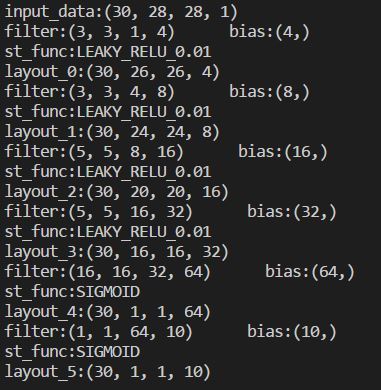

## NeuralNetwork-Numpy
### 模式识别大作业 使用numpy进行深度学习

### 网络核心

- net.py
- conv.py

### 使用方法
```
from net import ConvNet
net = ConvNet()
if not net.load(MODEL_PATH):      
        net.addConvLayout([3,3,1,4],bias = True,padding='VAILD',init_type=init_type,st_func='LEAKY_RELU_0.01')
        net.addConvLayout([3,3,4,8],bias = True,padding='VAILD',init_type=init_type,st_func='LEAKY_RELU_0.01')
        net.addConvLayout([5,5,8,16],bias = True,padding='VAILD',init_type=init_type,st_func='LEAKY_RELU_0.01')
        net.addConvLayout([5,5,16,32],bias = True,padding='VAILD',init_type=init_type,st_func='LEAKY_RELU_0.01')
        net.addConvLayout([16,16,32,64],bias = True,padding='VAILD',st_func='SIGMOID',init_type=init_type)
        net.addConvLayout([1,1,64,10],bias = True,padding='VAILD',st_func='SIGMOID',init_type=init_type)
```
- addData()：添加数据
- addConvLayout()：在当前网络最后面添加一层网络
  
支持卷积层，全连接层，Batch Normalization层

激活函数支持sigmoid,leaky_relu_alpha,alpha可以为任意值

- regress()：回归

支持MSE和交叉熵
支持多种优化器（SGD,Nesterov,RMSProp）

- count()：计算各层输出
- save()：保存权值
- load()：读取权值
### test.py的可视化输出


- print(net) 输出网络结构


注:输入前需addData()，并count一次

### 网络结构输出



### mnist可视化输出

- 运行mnist_visual_test.py可测试mnist数据集

- model文件夹内为mnist训练的模型，最新的模型只在batch_size=30的情况下训练了400次，我们在测试集上测试准确率达到了:95.38%


